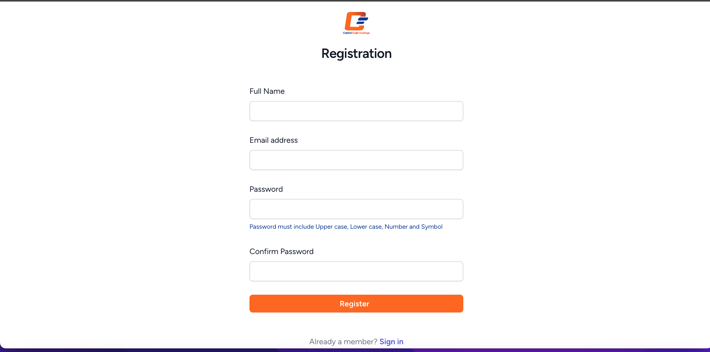

<table>
  <tr>
    <th>Endpoint</th>
    <th>Method</th>
  </tr>
 <tr>
    <td>GET /login</td>
    <td>createLoginForm</td>
  </tr>
  <tr>
    <td>POST /login</td>
    <td>login</td>
  </tr>
  <tr>
    <td>POST /logout</td>
    <td>logout</td>
  </tr>

  <tr>
    <td>GET /register</td>
    <td>createRegistrationForm</td>
  </tr>
  <tr>
    <td>POST /register</td>
    <td>register</td>
  </tr>
  <tr>
    <td>GET /bvn/verify-bvn</td>
    <td>createBVNVerificationForm</td>
  </tr>
  <tr>
    <td>POST /api/verify-bvn</td>
    <td>verifyBVN</td>
  </tr>
</table>

# SET UP GUIDE

Follow these steps to set up the project on your local machine:

#### CLONE THE REPO

Clone the repository to your local machine:

```bash
git clone https://github.com/ajayiMichael1010/capitalsage.git

## Install Dependencies
Run the following commands to install dependencies and set up the environment:

composer install
php -r "file_exists('.env') || copy('.env.example', '.env');"
php artisan key:generate

Configure Database
Add your database details to the .env file.

Start Local Server
Start your local server (xampp, wamp, etc.).
Start the Laravel server:
php artisan serve

Update Server URL
Replace the server URL with the APP_URL in the .env file.

Migrate Database Tables
Run database migrations to set up tables:
php artisan migrate

Install and Build Frontend
Install Node.js dependencies and build frontend assets:
npm install
npm run dev

Run Tests
Run tests to ensure everything is functioning correctly:
php artisan test

Explore Features
Take some time to explore and understand the authentication and BVN verification system features of the application.


